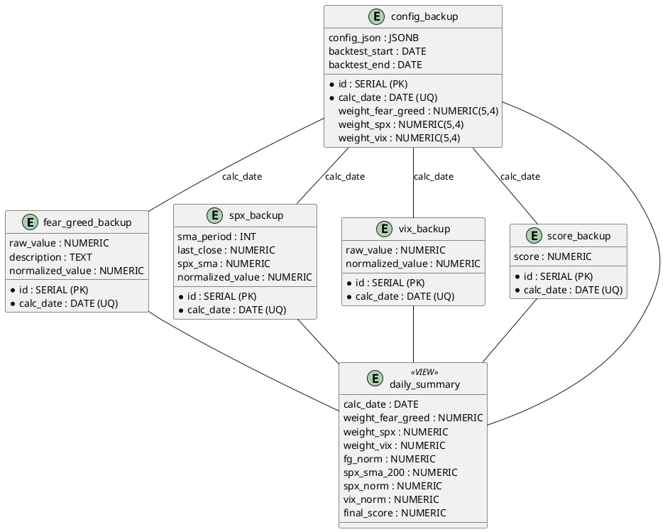

# Respaldo de Datos de Indicadores y Score Final

El modulo de respaldo de datos de indicadores tiene como objetivo principal asegurar la integridad y disponibilidad de los datos obtenidos y procesados por el sistema. A continuación, se describen las funcionalidades y características clave del modulo:

## Funcionalidades Principales

1. **Respaldo Automático**: El sistema realiza respaldos automáticos de los datos de los indicadores en intervalos regulares, garantizando que siempre haya una copia reciente disponible en caso de fallos o pérdidas de datos.
2. **Almacenamiento Seguro**: Los datos respaldados se almacenan en ubicaciones seguras, utilizando técnicas de cifrado para proteger la información sensible contra accesos no autorizados.

---

# Estructura de la base de datos `(PostgreSQL)`

El siguiente query puede ser ejecutado para crear las tablas necesarias para almacenar los datos de los indicadores y el score final, junto con una `vista` que consolida la información relevante para análisis y reportes.

````sql
```sql
-- 1. FearGreedIndicator
CREATE TABLE fear_greed_backup (
  id               SERIAL PRIMARY KEY,
  calc_date        DATE    NOT NULL,
  raw_value        NUMERIC,
  description      TEXT,
  normalized_value NUMERIC,
  CONSTRAINT ug_fg_date UNIQUE (calc_date)
);

-- 2. SPXIndicator
CREATE TABLE spx_backup (
  id               SERIAL PRIMARY KEY,
  calc_date        DATE    NOT NULL,
  sma_period       INT     NOT NULL,
  last_close       NUMERIC,
  spx_sma        NUMERIC,
  normalized_value NUMERIC,
  CONSTRAINT ug_spx_date UNIQUE (calc_date)
);

-- 3. VixIndicator
CREATE TABLE vix_backup (
  id               SERIAL PRIMARY KEY,
  calc_date        DATE    NOT NULL,
  raw_value        NUMERIC,
  normalized_value NUMERIC,
  CONSTRAINT ug_vix_date UNIQUE (calc_date)
);

-- 4. Configuración (igual que antes, con JSON + columnas de peso)
CREATE TABLE config_backup (
  id                   SERIAL PRIMARY KEY,
  calc_date            DATE    NOT NULL,
  config_json          JSONB  NOT NULL,
  weight_fear_greed    NUMERIC(5,4),
  weight_spx           NUMERIC(5,4),
  weight_vix           NUMERIC(5,4),
  backtest_start       DATE,
  backtest_end         DATE,
  CONSTRAINT ug_cfg_date UNIQUE (calc_date)
);

-- 5. Score final
CREATE TABLE score_backup (
  id        SERIAL PRIMARY KEY,
  calc_date DATE    NOT NULL,
  score     NUMERIC NOT NULL,
  CONSTRAINT ug_score_date UNIQUE (calc_date)
);

-- 6. Tabla para vista

CREATE VIEW daily_summary AS
SELECT
  c.calc_date,
  c.weight_fear_greed,
  c.weight_spx,
  c.weight_vix,
  fg.normalized_value AS fg_norm,
  sp.spx_sma         AS spx_sma_200,
  sp.normalized_value  AS spx_norm,
  vix.normalized_value AS vix_norm,
  s.score              AS final_score
FROM config_backup c
LEFT JOIN fear_greed_backup fg ON fg.calc_date = c.calc_date
LEFT JOIN spx_backup        sp ON sp.calc_date  = c.calc_date
LEFT JOIN vix_backup       vix ON vix.calc_date = c.calc_date
LEFT JOIN score_backup      s ON s.calc_date   = c.calc_date;
````

Para una compresion mas visual de la estructura de la base de datos, se puede utilizar la siguiente representación:


